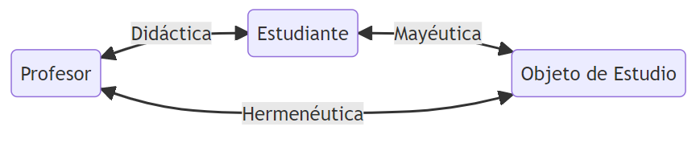

# Aprender a aprender

## Jhony Grillet (a.k.a. @ch1nux)

### (a.k.a. :computer: El Aguacate Programador :avocado:)

---
<!-- class: green -->

## Un poco de mí :sweat_smile:

:avocado: Javascript Developer (_circa 2012_).
:avocado: Profesor universitario.
:avocado: Ingeniero de Sistemas.
:avocado: Mentor e instructor de 4Geeks Academy.
:avocado: _Influencer (Tuitero)_ a tiempo parcial.
:avocado: Actualmente trabajo en [Cecropia Solutions][1]

---

---

## Epistemología... :thinking:

---

---

## Meta... ¿qué? Metaprendizaje

+ Tres planos
+ **Mayéutica**: Justifica la razón. Cuestiona lo aprendido/recibido.
+ **Hermeneútica**: Encuentra el porqué. Cuestiona el método/detalle.
+ **Didáctica**: Herramientas para enseñar/aprender. Es bidireccional.

---

---

## Desde el punto de vista didáctico:

0. **Disposición a estudiar/aprender.**

1. Identifica tu tipo de aprendizaje :nerd_face:.
2. Evita distracciones.
3. Usa períodos fijos y consistentes.
4. Plantea objetivos realistas.
5. ... :smirk:

---

## **Disposición a estudiar/aprender**

:avocado: ¡Descansa!
:avocado: Ejercicios de respiración.
:avocado: Tu música favorita.
:avocado: Ejercicio físico.

---

## **Identifica tu tipo de aprendizaje**

:avocado: Modelo de Kolb:
  + Experiencia concreta (EC).
  + Observación reflexiva (OR). 
  + Conceptualización abstracta (EA).
  + Experimentación activa (EA).

---

## **Evita distracciones**

:avocado: Ten un espacio de estudio.
:avocado: ¡Aleja el celular!
:avocado: Ten un plan de estudio antes.
:avocado: Prioriza primero, recompensa luego.

---

## **Usa períodos fijos y consistentes**

:avocado: Pomodoro, Trello, ClickUp, Notion, Calendly, etc.
:avocado: Recordatorios en el reloj.
:avocado: ¡Aprovecha el tiempo!
:avocado: No usar el tiempo para procrastinar.

---

## **Plantea objetivos realistas...**

---

## **No pasa nada si te equivocas** :pray:

---

## El aprendizaje...

:avocado: Es un proceso complejo.
:avocado: Involucra emoción, intuición, autoevaluación y consciencia.
:avocado: Requiere didáctica, pero el(los) método(s) no lo son todo.
:avocado: Es individual, no compartido.
:avocado: No puede generalizarse.
:avocado: No está escrito en piedra.

---

[1]:https://www.cecropia.co/