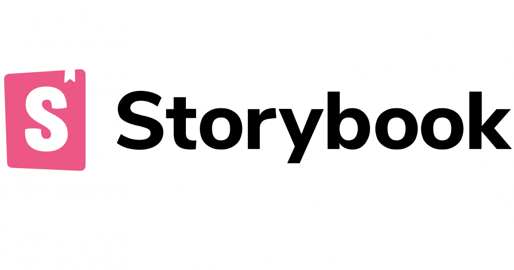

  
  

  <h1>Sistemas de Diseño ¿qué es eso?</h1>
  <h2>Jhony Grillet (a.k.a. @ch1nux)</h2>
  <h3>(a.k.a. El Aguacate Programador)</h3>

---

# Contenido del taller

  

    <ul style="font-size: 28pt; line-height: 3rem;">
      <li>Discordia...</li>
      <li>vs. Librería de Componentes</li>
      <li>Leyes de UX</li>
      <li>Sistemas de Diseño existentes</li>
      <li>Conclusiones...</li>
      <li>...y memes!</li>
      <li>Demo XD</li>
    </ul>
  

  

    
  

---

# Primero que nada...

  

---

# Discordia... 🤷🏼‍♂️

  

    <ul>
      <li><strong>Wikipedia</strong>: Conjunto de componentes que
      definen requerimientos específicos para un sistema.</li>
      <li><strong>Uxable.com</strong>: Activos reusables que definen interfaces.</li>
      <li><strong>Design Handbook</strong>: Una balanza entre el control estricto y el caos que produce la libertad.</li>
      <li><strong>Adobe Inc.</strong>: Define el lenguaje de marca, su signo y
      su significado.</li>
    </ul>
  

  

    
  

---

# vs. Librería de Componentes

  
  
  

  
  
  

---

# Leyes de UX

<ol>
  <li><strong>Ley de Pareto</strong>: El 80% de los efectos provienen del 20% de las causas.</li>
  <li><strong>Ley de Tesler</strong>: Para cualquier sistema existe una cierta cantidad de complejidad que no se puede reducir.</li>
  <li><strong>Ley de Hick</strong>: El tiempo que lleva tomar una decisión aumenta con el número de alternativas y su complejidad.</li>
  <li><strong>Ley de Prägnanz</strong>: Las personas interpretan las imágenes complejas como la forma más simple posible, porque es la interpretación que menos esfuerzo cognitivo requiere.</li>
  <li><strong>Ley de Jakob</strong>: Los usuarios prefieren aquellos sitios que funcionen igual que los que ya conocen.</li>
</ol>

  

---

  <h1>✨✨✨✨ Usabilidad ✨✨✨✨</h1>

---

# Definición "aguacatística" 🥑

  

    <ul>
      <li><strong>Uniformidad</strong>: Consenso detallado y específico de funcionamiento</li>
      <li><strong>Evolutivo</strong>: Cada proceso puede y debe ir cambiando para aportar valor, sin que eso afecte el proceso general (si existiera)</li>
      <li><strong>Agnóstico</strong>: Independiente de la tecnología que lo soporte</li>
      <li><strong>Significativo</strong>: Cada componente debe tener un valor en su conjunto y no
      aislado del resto de componentes</li>
      <li><strong>Minucioso</strong>: La especificidad es un aspecto crítico al definir un
      sistema de diseño, respondiendo al qué, al cómo y al porqué</li>
    </ul>
  

  

    
  

---

# Sistemas de Diseño existentes

  
  

  

---

# Conclusiones

  

    <ul>
      <li>La usabilidad como finalidad y no como característica</li>
      <li>Enfocarse en lo importante</li>
      <li>Inversión del control</li>
    </ul>
  

  

    
  

---

# Demo XD

  

## Manos a la ubre... 🐄
