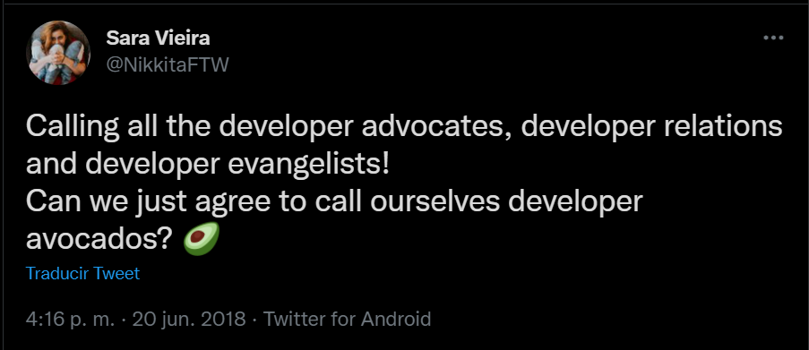
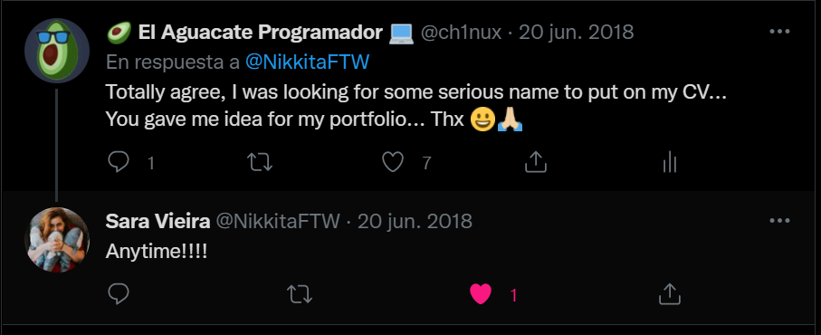
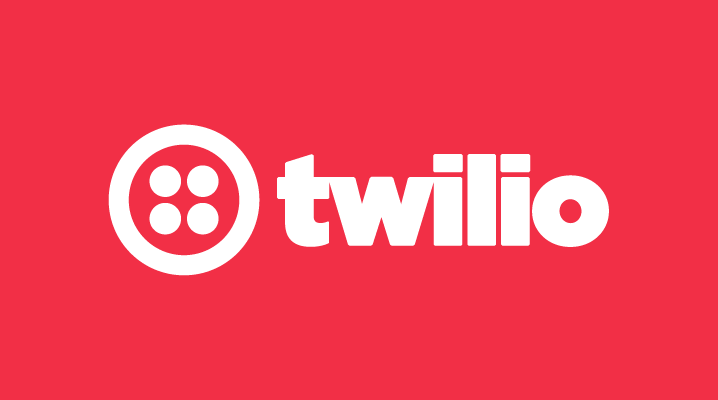
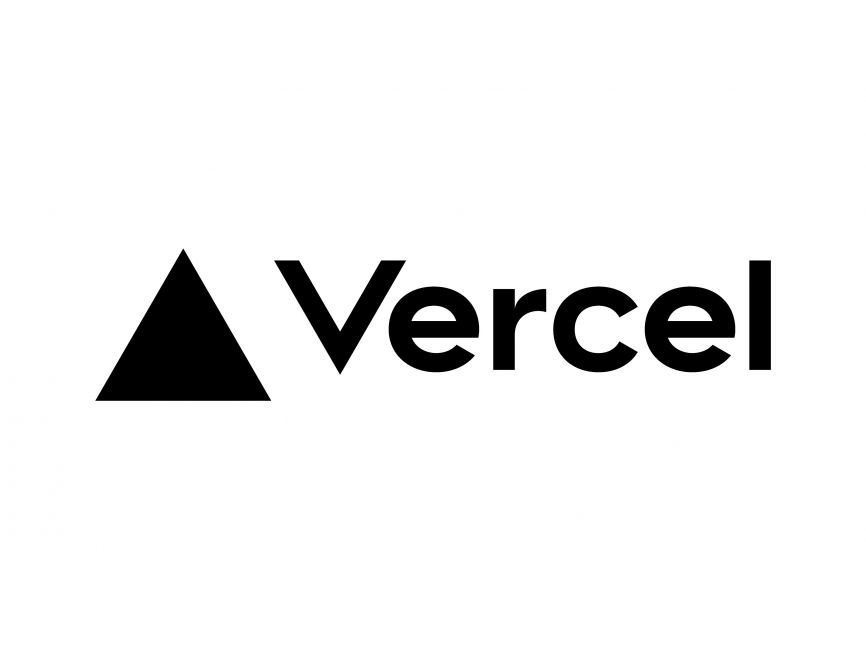

# Hablemos de: Developer Advocacy :avocado:

## Jhony Grillet (a.k.a. @ch1nux)

### (a.k.a. El Aguacate Programador)

---

<!-- class: gaia -->

## Un poco de mí :avocado:

:avocado: Javascript Developer (_circa 2012_).
:avocado: Profesor universitario.
:avocado: Ingeniero de Sistemas.
:avocado: Mentor e instructor de 4Geeks Academy España y Venezuela.
:avocado: Mentor y bloguero a tiempo parcial.
:avocado: Actualmente trabajo en una empresa **"insurtech"** llamada [Venemergencia](https://www.venemergencia.com)

---

---

## Contenido del taller

:avocado: Contexto e introducción.
:avocado: Qué no es.
:avocado: Una definición \[in\]formal
:avocado: Aspectos fundamentales.
:avocado: Estrategias.
:avocado: Que se necesita.
:avocado: Programas exitosos.
:avocado: Consideraciones Finales

---

## Contexto e introducción

:avocado: A menudo se conoce bajo el(los) nombres de: _Developer Relations_, _Developer Evangelists_, _API Evangelists_ y _Developer Avocados_.
:avocado: Developer Advocacy **NO** es nuevo.
:avocado: Empezó como un rol de ventas.
:avocado: Su público es técnico o aficionado.
:avocado: Orientado **solo** a tecnología.

---

## Que NO es

:avocado: Un rol de ventas.
:avocado: Una sola persona.
:avocado: Un proceso más.
:avocado: Obligatorio.
:avocado: Una sola área.
:avocado: Solo hablar de código.
:avocado: Gratis.

---

<!-- _class: lead gaia -->

## :avocado: Developer Advocacy :avocado:

Se refiere al programa **multidisciplinario**, con representación individual o en nombre de una empresa, que se centra en la **creación de contenido** de **valor** para establecer **comunidades**, potenciales relaciones comerciales con particulares y/o otras empresas.

---

---

<!-- _class: lead gaia -->

:avocado::avocado::avocado::avocado::avocado::avocado::avocado::avocado::avocado::avocado::avocado::avocado::avocado::avocado::avocado::avocado::avocado::avocado::avocado::avocado::avocado:

:avocado: **Developer Advocacy == Developer Experience** :avocado:

:avocado::avocado::avocado::avocado::avocado::avocado::avocado::avocado::avocado::avocado::avocado::avocado::avocado::avocado::avocado::avocado::avocado::avocado::avocado::avocado::avocado:

---

## Aspectos fundamentales (las 4 "C").

:avocado: **Código**: Mostrar productos o servicios, stacks, procesos de construcción, patrones de diseño, APIs.
:avocado: **Contenido**: Tutoriales, blogs, boletines de correo con avances en tecnología de la empresa.
:avocado: **Comunicación**: Podcasts, webinars, conferencias, charlas gratuitas o patrocinadas.
:avocado: **Comunidad**: Por fortuna, las redes sociales y muchas aplicaciones como Discord y Slack han facilitado la creación de comunidades.

---

## :avocado: Objetivos del Developer Advocacy :avocado:

1. Establecer comunidades interactivas en torno a la marca del producto o servicio
2. Generar visibilidad del producto o servicio
3. Mantener o aumentar un retorno de inversión sostenible y real en el tiempo
4. Crear contenido en torno a la marca del producto o servicio.
5. Definir una estrategia de marketing que sea transversal e involucre la mayor parte de la empresa, especialmente desarrolladores

---

## Que se necesita.

:avocado: **Experiencia**: Un _buen_ Developer Avocado tiene experiencia suficiente en su área, la necesaria para poder explicar los conceptos y el valor que aporta, de una forma simple y didáctica.

---

## Que se necesita

:avocado: **Empatía**: Muestra curiosidad genuina y pasión por lo que está hablando y/o escribiendo, por el contenido que está produciendo y por el valor que está predicando, y dicha pasión la transmite a la comunidad.

---

## Que se necesita

:avocado: **Escuchar**: Tiene escucha activa de oportunidades de mejora y no solo para reaccionar, evitando todos los posibles sesgos cognitivos y malentendidos antes, durante y después de la negociación/comercialización de producto.

---

---

## Programas exitosos

:avocado: Google incluye uno de los mejores programas de on-boarding en una empresa de tecnología de software.

:avocado: Twillio posee una academia completamente gamificada con retos y premios en metálico que involucran el consumo de sus servicios.

---

## Programas exitosos

:avocado: El CEO de Vercel, Guillermo Rausch es también Developer Advocate, siendo que es su creador.

:avocado: MongoDB ha creado una academia global y gratuita para enseñar a usar su producto en multitud de lenguajes de programación.

---

## Programas exitosos

:avocado: Multitud de webinars, podcasts y su propia agencia de Developer Advocacy, [Notionology](https://notionology.com)

:avocado: X-Team ofrece a sus desarrolladores, entre múltiples beneficios, un bono de $2500 USD para consumos personales.

---

## Consideraciones finales

:avocado: Caracterizar los productos tecnológicos.
:avocado: Caracterizar el público objetivo.
:avocado: Definir el lenguaje de cara al público objetivo.
:avocado: Definir los canales de comunicación a utilizar.
:avocado: Hace énfasis en el valor que se está aportando.

---

## Consideraciones finales

:avocado: Tomar en consideración el tiempo, los recursos didácticos y el interés del público objetivo.
:avocado: Estar en constante revisión de los objetivos mediante indicadores.
:avocado: La comunidad es un excelente indicador de un programa de developer advocacy exitoso.

---

